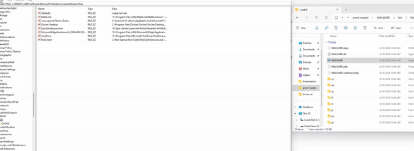

### T1547.001, Boot or Logon Autostart Execution: Registry Run Keys / Startup Folder

hi guys welcome back to my channel todfay we are writing things to the registry

so this #malicious software writes itself to the registry and moves itself to the window/system32 to run as the computer starts itself up. thjis is just a proof of concept so it doesnt harm anything just makes a window appear in front of you (wowi) (so cool)

here's a gif... 

